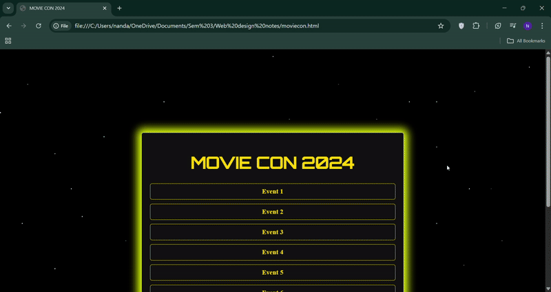

# 🎬 Starwars themed interactive linktree for fest
=
This futuristic and visually dynamic webpage is designed to serve as a central hub for all event links for the festival.

> 🌟 Features blinking stars, slide-up animations, hover effects, and more to give a space-themed cinematic feel.

## 🎥 Demo




## 🚀 Features

✨ **Starry Animated Background**
📜 **Dynamic Slide-Up Entry for Each Event**
🎥 **Orbitron Font & Glowing Effects for a Futuristic Vibe**
🖱️ **Hover Animations for Interactive Feel**
🎬 **Fully Responsive Design**

---

## 📁 Project Structure

```
movie-con-2024/
├── index.html          # Main webpage
├── assets/
│   └── background.mp4  # (Optional) Background video (currently local, see note below)
└── README.md
```

---

## 💡 Usage Instructions

1. Clone or download this repository:

```bash
git clone https://github.com/your-username/movie-con-2024.git
```

2. Replace the placeholder video in the `<video>` tag in `index.html` with a valid online URL or host your video in the `assets/` folder:

```html
<source src="assets/background.mp4" type="video/mp4">
```

3. Update event links in the `<ul>` section:

```html
<li class="event"><a href="event1.html">Event 1</a></li>
```

4. Open `index.html` in your browser to view the interactive page.

---

## 🛠️ Technologies Used

* **HTML5**
* **CSS3** (Animations, Styling)
* **Google Fonts** – Orbitron
* **Vanilla JavaScript** (optional if you add interaction later)

---

## 📦 Deployment Suggestions

You can host this on:

* GitHub Pages
* Netlify
* Vercel

---

## 🔮 Future Improvements

* Add mobile navigation or buttons
* Dynamic event loading via JSON
* Countdown timer or live schedule
* Sound effects or background music

---

## 📝 License

This project is open-source and free to use under the [MIT License](LICENSE).
